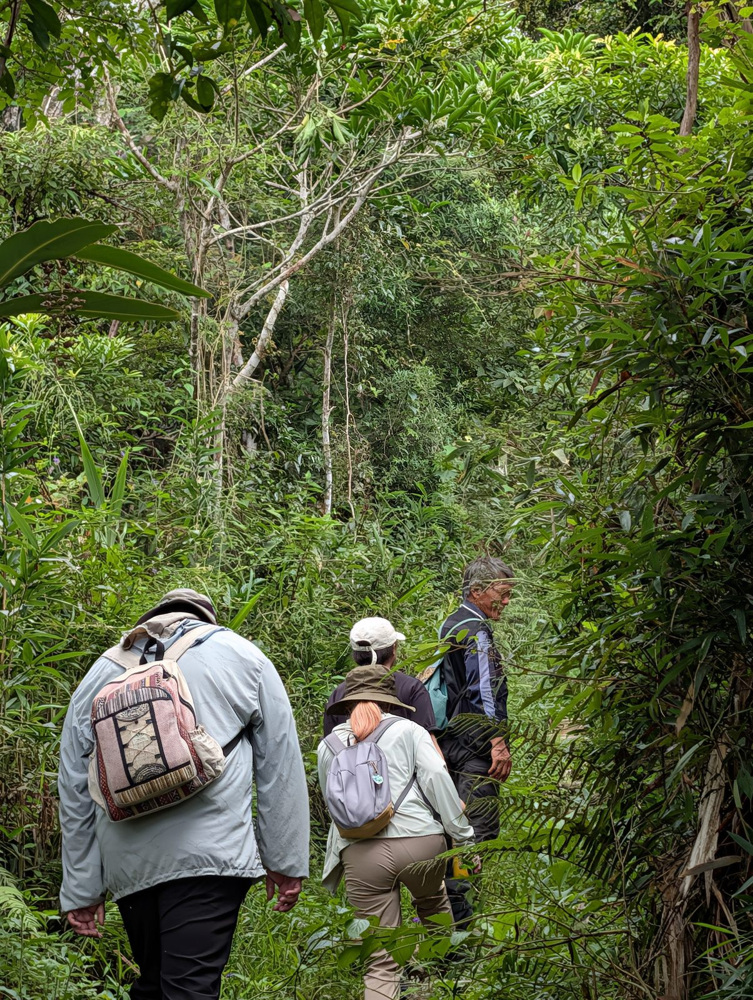
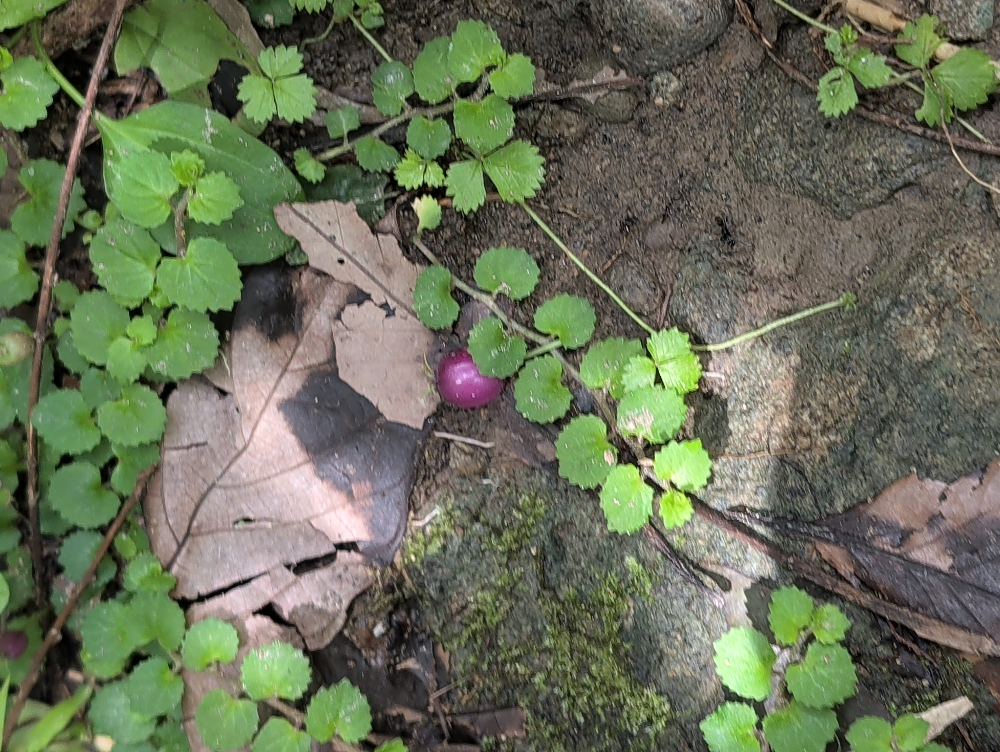
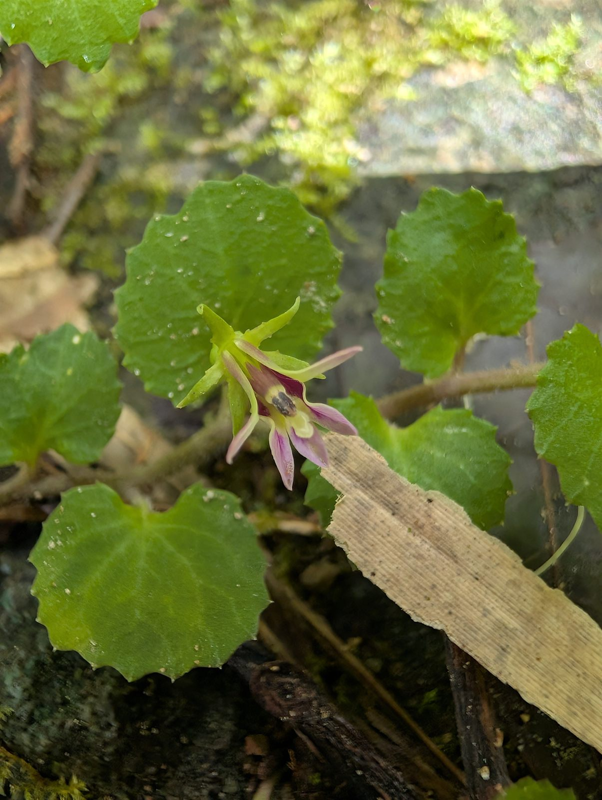
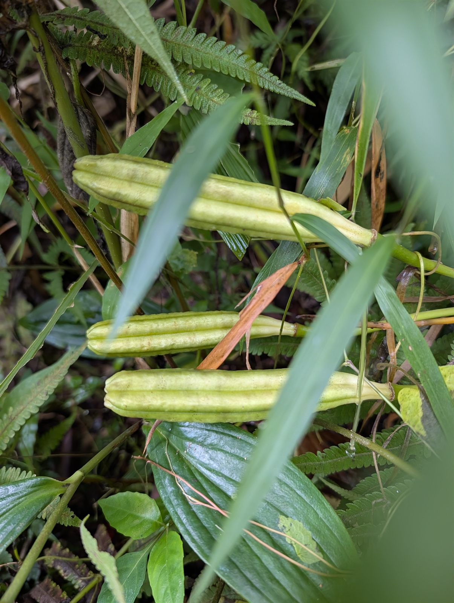
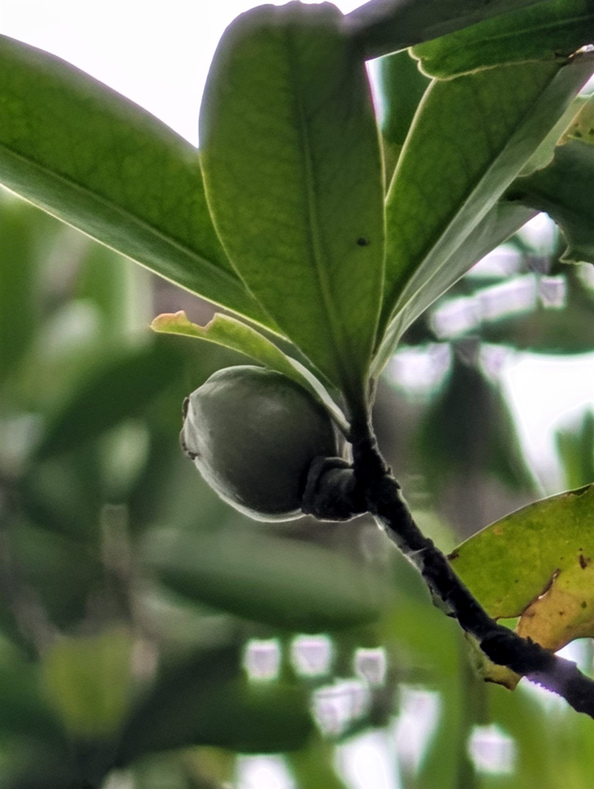
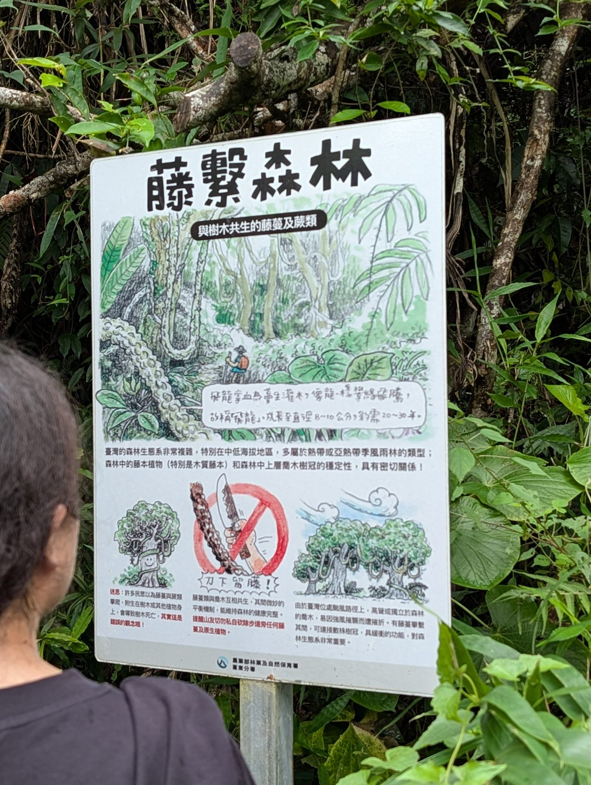
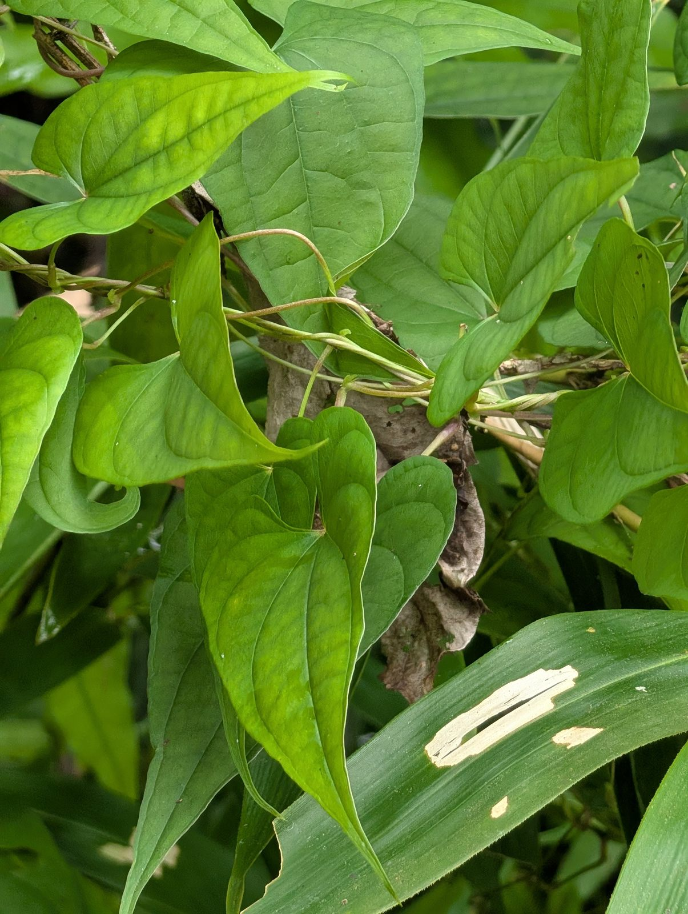
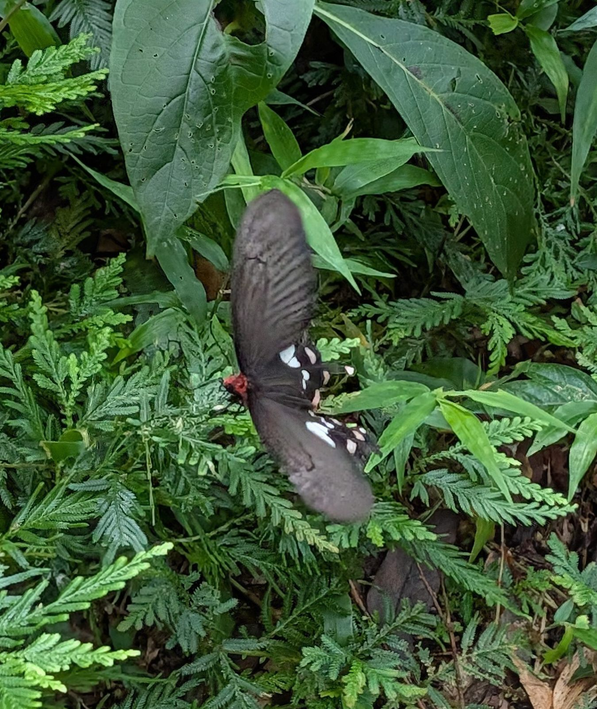
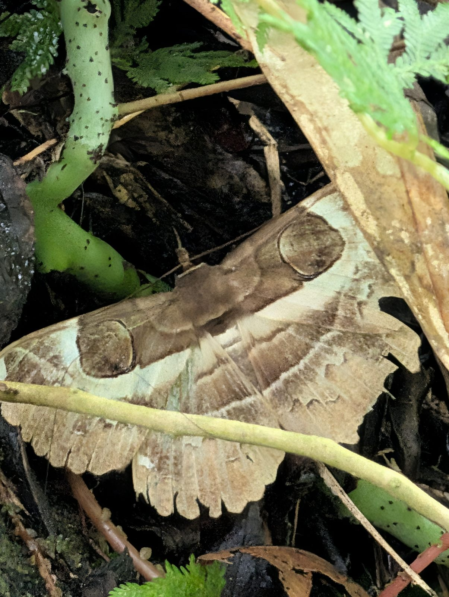
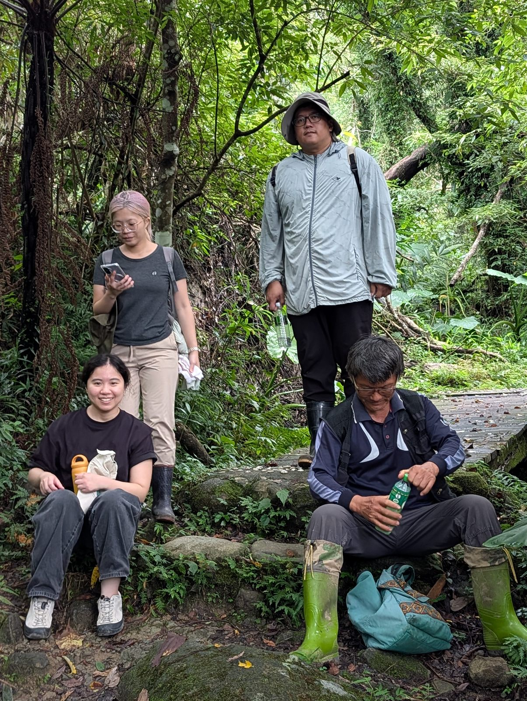

# 🌿 都蘭山的呼吸，與萬物共生的節奏
## —— 2026.09.06 都蘭山九月定點觀察遊記

> **時間**：2026 年 9 月 6 日（星期日） 08:30 - 12:30  
> **地點**：台東縣東河鄉 都蘭山步道（登山口至木棧道大石休憩區，海拔約 500m ~ 700m+）  
> **帶隊與隨行引路**：施炳霖老師  
> **共學夥伴**：都蘭共學堂 x 綠光食物森林學校夥伴  
> **紀錄撰寫**：都蘭共學堂夥伴  

---

### 【前言】同一個山頭，不同的眼睛

走進九月的都蘭山，空氣裡已經悄悄褪去了盛夏酷熱的焦躁，轉而沉澱為一縷濕潤而清爽的初秋微涼。

「都蘭山定點觀察」的意義，從來不是急著攻頂或收集三角點，而是**每個月挑選同一天、走同一條山徑，用身體和五感去感受山林的流轉**。

出發前，大家在郡界土地公廟集合，施炳霖老師一邊整理裝備，一邊和大家分享他凝視自然數十年的心得：

> 「你站在這根樹枝的左邊看，跟從右邊看，看到的完全不是同一回事。看事情有多個面向，大自然更是如此。生物世界裡，每種生物都活在自己的生命節律裡——桂花不會想著開玫瑰花，牠們專注做好自己。我們走進森林，也是學習把心慢下來，看清土地真正要告訴我們的話。」

這一天，我們跟隨著施老師的腳步，踏上了這座被阿美族與卑南族視為聖山的蒼翠山巒。

---

### 一、 宏觀地理：北回歸線上的綠色奇蹟與活水庫

步道緩緩上升，身旁的樹蔭逐漸籠罩，擋去了晨光的直射。施老師聊起了台灣這座島嶼在地球生態系中不可思議的得天獨厚：

在全球的地理圖景中，北回歸線穿過的板塊大部分是乾燥的沙漠與荒原，例如墨西哥、撒哈拉與阿拉伯半島。然而台灣卻是一座漂浮在太平洋上的「綠色翡翠」，原因正是**中央山脈兩百多座超過三千公尺的巨峰，以及橫亙在東海岸一千多公尺的都蘭山**。

終年奔騰於東部海域的**黑潮暖流**，帶來豐沛的蒸騰水氣；當東北季風夾帶海風撞擊到都蘭山高聳的山嶺，雲霧繚繞，化作滋養萬物的水滴。

這片鬱鬱蔥蔥的森林，正是台東最天然的「綠色巨型水庫」。都蘭溪的源頭在此孕育，雨水穿過層層樹冠、浸潤苔蘚厚毯、滲入落葉腐植土層，再徐徐釋放。即便入夏前曾經乾旱數月，但只要秋初這兩場甘霖一落，林下的過貓（蹄蓋蕨）與各種草木便能以驚人的韌性在一夜之間舒展復甦。

  
*▲ 夥伴們踏著輕快的步伐，走入都蘭山鬱閉度極高的闊葉原始林蔭中。*

---

### 二、 微觀林下：初秋的結果期與地表小珍寶

秋天，是多數中低海拔植物結果封收的時節。

我們放慢了腳步，眼睛開始習慣在綠色的漸層中尋找細微的變化。

一低頭，在鋪滿腐葉的步道邊緣，大家驚呼了一聲。只見匍匐於岩面與泥土的低矮藤蔓間，結著一顆晶瑩如紫色寶石般的小漿果——那是**普刺特草**（又名地茄子、銅錘玉帶草，*Lobelia nummularia*）。它那帶有鋸齒的小圓葉在陰濕地表鋪展，鮮艷的紫紅果實讓人忍不住屏息細看。

  
*▲ 步道邊宛如天然紫玉髓的「普刺特草」成熟漿果。*

不遠處，我們又在石縫草叢中找到了它正值花期的精緻小花。普刺特草的花瓣極具特色，呈現單側開裂的淡紫色管狀羽扇，宛如林間精靈張開的微小翅膀。花與果同時出現在同一個秋天，具象地演繹著生命的接力與循環。

  
*▲ 普刺特草獨特如羽扇裂開的淡紫白色小花。*

林徑兩側還能看見昂然直立的**台灣百合**（*Lilium formosanum*）。夏季綻放的白色喇叭花早已功成身退，如今枝頂挺立著三個飽滿修長的綠色蒴果，像三支直指天際的綠色號角，等待著晚秋乾枯開裂後，讓數以百計帶薄翅的種子乘著山風飛向遠方。

  
*▲ 挺立於芒草蕨叢旁的台灣百合直立蒴果。*

身旁的枝頭間，**大頭茶**的青澀幼果結在葉腋與枝端，火炭母草攀附在灌木上向陽生長，還有揉碎後散發特有辛香微辣與微鹹風味的**台灣胡椒**（風藤）。施老師笑著讓大家辨識氣味，大自然在不同植物裡合成的微量元素與芳香分子，是山林最深邃的調味盤。

  
*▲ 枝頭青翠微圓的大頭茶幼果，靜靜積蓄著秋季大地的能量。*

---

### 三、 深度思辨：藤繫森林，「刀下留藤」的共生之網

走過一處向陽轉角，一面林務局的解說牌吸引了大家的目光——**「藤繫森林：與樹木共生的藤蔓及蕨類」**。

  
*▲ 步道旁的生態解說牌：「刀下留藤！藤蔓與喬木並非死敵，而是互相扶持的共生夥伴。」*

施老師停下腳步，指著纏繞在巨木樹幹上的木質藤本（如飛龍掌血、菊花木）與緊貼樹皮向上爬行的**拎壁龍**（*Psychotria serpens*），為大家上了一堂極具啟發性的植物生理課：

一般人常有「藤蔓會把大樹絞死」的刻板印象，甚至登山客常帶著開山刀隨意砍斷粗壯的樹藤。但施老師告訴我們：
1. **樹幹增粗的生理機制**：樹幹的木質部在內、韌皮部在外，中間是分裂活躍的「形成層」。最外層的樹皮木栓層其實是老死組織，會隨著樹徑變粗而自然乾裂脫皮。像拎壁龍這樣的附生爬藤，靠著不定氣生根抓牢樹皮表層，並不會深入破壞樹幹深處的輸導組織。
2. **狂風中的「抗颱安全網」**：台灣東海岸是颱風的第一線登陸走廊。巨大的木質藤蔓在樹冠之間相互穿梭纏繞，把各自獨立的高大喬木在空中「編織」成一座連通的張力網。當 17 級強颱掠過，受力不再由單一樹木孤立承受，而是由整片相連的樹冠共同分散緩衝！藤蔓不是樹的絞殺者，而是暴風雨中與巨木並肩攜手的患難盟友。

看著那盤旋蜿蜒直上雲端的藤條，我們由衷體會到大自然的深邃設計：**沒有誰是誰的累贅，林冠下的每一場攀爬，都是生命為了共存而譜寫的默契。**

  
*▲ 翠綠的藤本植物葉片交錯生長，巧妙利用林隙灑落的每一縷陽光。*

---

### 四、 林間精靈：驚鴻一瞥的翩飛與擬態大師

步道行經溪谷水源邊，陽光透過樹冠的孔隙灑在蕨類上，形成斑駁的光斑。

突然，一道黑色的光影在綠葉間翩翩起舞——那是一隻美麗的**麝香鳳蝶**。牠黑褐色的翅面上點綴著醒目的粉白斑點，腹部與胸側隱現著鮮紅的絨毛。當牠輕盈地停棲在翠綠的蕨葉上振翅時，那份優雅與輕靈，瞬間點亮了幽深的森林。

  
*▲ 停棲於綠意間的麝香鳳蝶，紅與黑的搭配宛如林間的精靈。*

而在更不起眼的腐木落葉堆旁，夥伴差點一腳踩過的地方，施老師眼尖地叫住了大家。

仔細一看，那片看似平平無奇的枯黃落葉，竟然是一隻體型碩大的**魔目夜蛾**！牠雙翅平展，翅膀邊緣有著如同破枯葉般的波浪紋理，最令人讚嘆的是翅面中央一對栩栩如生的巨大「眼斑」擬態，宛如貓頭鷹炯炯有神的雙眼，威懾著可能靠近的天敵。若非屏息凝視，根本無法分辨牠究竟是一片落葉，還是一個活生生的呼吸體。

  
*▲ 完美偽裝成乾枯落葉的魔目夜蛾，展現出令人嘆為觀止的大自然擬態之美。*

---

### 五、 海拔七百米的大石：共享清泉與茶香

步道走到約海拔 700 多公尺處，經過一座小巧古樸的木棧道與潺潺山澗。這裡的氣候格外沁涼，山風徐來，完全感受不到平地近三十度的高溫。

施老師找了一處平坦的大岩石坐下，笑著招呼大家歇息。

  
*▲ 在都蘭山 700 公尺處的木棧道溪石旁，施炳霖老師（右下前座）與夥伴們開懷合影留念。*

大家卸下行囊，有人擰開水壺，施老師扭開隨身的無糖冷泡綠茶，夥伴們拿出了乾糧、水果與零食在石面上擺開。

在都蘭山定點觀察的這條路上，**「在石頭上共享」已經成為我們最珍視的一道儀式**。四周是高聳的筆筒樹、攀附的薜荔、蒼鬱的殼斗科老樹；耳畔是細碎的水流聲與鳥鳴。大家一邊吃著點心，一邊回味剛剛看見的花草蟲鳥，聊著生活、聊著社區食物森林的推動、聊著 AI 工具如何幫助我們整理山林筆記。

生命的步調在這裡回歸到最純粹的頻率。不需要趕路，不需要設定什麼高大上的目標，只要像一棵樹一樣，穩穩地站在這裡呼吸。

---

### 【結語】定點觀察：練習帶著意識與土地連結

下山的路上，山嵐漸漸升起，都蘭山再次籠罩在一層朦朧神秘的霧幔之中。

從八月到九月，同一個木棧道、同一個岩石區，上個月看見的天牛與白蕈菇退場了，取而代之的是初秋的紫果、百合果莢、翩飛的鳳蝶與落葉中的夜蛾。

這正是「定點觀察」教會我們最寶貴的一件事：
**大自然從不說話，但它每分每刻都在用具體的生命向我們展現「因時而動、順應自然」的智慧。**

每個月走一次都蘭山，不是為了征服山，而是讓山一次又一次地洗滌我們。期待十月的都蘭山，又會為願意慢下來的我們，準備什麼樣的驚喜。

---

#### 📌 本次觀察物種整理清單

| 分類 | 物種名稱 | 現場觀察筆記與特徵 |
| :--- | :--- | :--- |
| **植物** | **普刺特草**（銅錘玉帶草） | 桔梗科半邊蓮屬。同時觀察到成熟紫紅色多汁漿果與淡紫白色單側開裂小花。 |
| **植物** | **台灣百合**（蒴果） | 百合科。花期已過，枝端挺立三個圓柱狀直立成熟果莢（蒴果）。 |
| **植物** | **拎壁龍** | 茜草科。氣生根攀附老樹樹皮，與喬木形成良好附生共生關係。 |
| **植物** | **大頭茶**（幼果） | 山茶科。枝端結有圓錐狀木質青綠蒴果，厚革質葉耐風抗旱。 |
| **植物** | **台灣胡椒**（風藤） | 胡椒科。葉揉碎具特殊辛辣微鹹芳香，為林下優質民俗藥用芳香植物。 |
| **植物** | **火炭母草** | 蓼科。草質藤狀，蔓延能力強，分佈於林緣向陽處。 |
| **昆蟲** | **麝香鳳蝶** | 鳳蝶科。黑色翅膀帶白色斑紋，胸腹帶鮮紅色絨毛，優雅於蕨類間翩飛。 |
| **昆蟲** | **魔目夜蛾** | 夜蛾科（裳夜蛾科）。翅膀展開具顯著大眼狀同心圓斑紋，完美擬態乾枯落葉。 |

---

*紀錄建立於 2026 年 9 月 8 日 ｜ 都蘭共學堂 ✕ 綠光食物森林學校計畫*